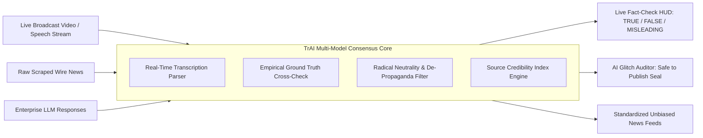

# TrAI Institutional Pitch Deck & B2B Commercial Presentation
> **Document Purpose:** Presentation Guide & Slide Deck for pitching the **TrAI Trust Engine Platform** to Enterprise Clients, Broadcast Networks, Financial Institutions, and Strategic Investors.
> **Format:** Ready-to-present Markdown Slide Deck with Speaker Notes, Objection Handling, and Live Demo Walkthroughs.

---

## Slide 1: Cover Slide & Vision Statement
```
╔═══════════════════════════════════════════════════════════════════════════════════════╗
║                                                                                       ║
║                                  T r A I   E N G I N E                                ║
║                    The Institutional Truth Layer for Enterprise AI                    ║
║                                                                                       ║
║                 Real-Time Video/Audio Fact Checking • AI Hallucination Guardrails     ║
║                             Autonomous Anti-Propaganda Consensus                      ║
║                                                                                       ║
╚═══════════════════════════════════════════════════════════════════════════════════════╝
```
* **Presenter:** Business Development & Solutions Engineering
* **Audience:** C-Level Executives (CEO, CTO, Chief Risk Officer), Newsroom Directors, FinTech Leaders

### 🎙️ Speaker Pitch (What to Say):
> *"Good morning/afternoon everyone. Today, every enterprise and media organization is betting their future on rapid information and AI. But there is a fatal blind spot: **How do you know what you are broadcasting, trading on, or publishing is actually true?**
> Today, we are introducing **TrAI**—the world’s first institutional Trust-as-a-Service engine designed to verify live speech on broadcast television in real-time, audit AI outputs before they hallucinate, and provide an unbiased consensus layer for the modern world."*

---

## Slide 2: The Macro Problem: The Crisis of Trust & Liability
### The Three Fatal Vulnerabilities Facing Organizations:
1. **The Broadcast Network Dilemma (Real-Time Misinformation):**
   * Live speeches (political rallies, presidential debates, e.g., statements from figures like Donald Trump, foreign ministers, or corporate CEOs) are spoken at 150 words per minute.
   * If false or misleading claims are broadcast without context, networks face massive credibility collapse, public backlash, and regulatory scrutiny.
2. **The Enterprise AI Hallucination Disaster:**
   * Generative AI models (ChatGPT, Gemini, internal LLMs) frequently experience **"hallucination glitches"**—inventing non-existent legal precedents, falsifying medical studies, and inventing quotes.
   * *Business Impact:* Multi-million dollar compliance liabilities and customer distrust.
3. **Financial Market Chaos:**
   * Synthetic press releases and uncorroborated social media rumors trigger flash crashes before human analysts can verify the source.

---

## Slide 3: The Solution: TrAI — "Trust-as-a-Service" (TaaS)
### What TrAI Is:
TrAI is an **algorithmic truth gateway** sitting between raw incoming streams and downstream consumers.



### Key Pillars:
* **Sub-Second Live Audio/Video Fact Audits:** Transcribes and flags false or misleading spoken statements in real-time.
* **AI Output Hallucination Guardrail:** Evaluates LLM answers against verified factual knowledge graphs to catch glitches.
* **Radical Objectivity:** Replaces emotionally charged adjectives and partisan framing with cold, verified empirical facts.

---

## Slide 4: Feature Deep-Dive #1: Live Video/Speech Fact-Checking Plugin

### 🎯 Primary Customer: Television Networks, Streaming Platforms, Debate Moderators, Newsrooms
```
               [ LIVE BROADCAST AUDIO / VIDEO STREAM ]
                                  │
                                  ▼
             [ Real-Time Audio Transcription (Whisper / Speech API) ]
                                  │
                                  ▼
                    [ TrAI Live Fact-Check Engine ]
                                  │
    ┌─────────────────────────────┴─────────────────────────────┐
    ▼                                                           ▼
[ EMPIRICAL VERDICT ]                               [ FACTUAL CONTEXT & ANCHORS ]
• Status: MISLEADING                                • "25% tariffs occurred in March 2018."
• Trust Score: 38/100                               • "BLS recorded 2.4% CPI inflation, not zero."
• Speaker: Donald Trump                             • "Manufacturing added 450k jobs, not 100%."
```

### Why Broadcast Networks Buy This:
* **Immediate Lower-Third Graphics & Producer Alerts:** News anchors receive instant data-backed corrections in their earpieces before going to commercial break.
* **Live Web Stream Widget:** Viewers can watch a presidential debate or press conference with a dynamic, real-time fact-checking overlay running alongside the video.

---

## Slide 5: Feature Deep-Dive #2: Enterprise AI Glitch & Hallucination Auditor

### 🎯 Primary Customer: B2B Enterprise AI Teams, Customer Support, LegalTech & FinTech
Before an internal AI agent answers a high-stakes customer query, TrAI inspects the answer.

| Enterprise Concern | Without TrAI | With TrAI Guardrail |
| :--- | :--- | :--- |
| **Fabricated Legal/Regulatory Citations** | Model outputs non-existent laws; company is sued. | **BLOCKED:** TrAI flags citation as unverified and blocks output. |
| **Mathematical / Data Glitches** | Model misquotes financial quarter metrics by 10x. | **CORRECTED:** Flagged with high-severity glitch alert. |
| **Model Hallucination Rate** | Untracked; unpredictable liability. | **Quantified:** Trust Index score (0-100%) and "Safe to Publish" certification. |

---

## Slide 6: Feature Deep-Dive #3: News Propaganda Stripping & Consensus Engine

### 🎯 Primary Customer: Intelligence Analysts, Defense, Wire Services, Fact-Checking Organizations
* **Propaganda Filter:** Automatically strips emotional triggers, loaded rhetoric, and double standards across adversarial sources (e.g. standardizing biased language into objective verbs).
* **Consensus Extraction:** Isolates facts that are independently corroborated by 2+ non-aligned sources.
* **"RED STATUS" Insider Leak Detection:** Flags speculative rumors and unverified predictions before they contaminate primary reporting.

---

## Slide 7: Technical Stack & Institutional Reliability

### Enterprise-Grade Infrastructure Built on Proven Technology:
* **Microservices Framework:** Spring Boot 4.0.3 running on Java 21 LTS for maximum concurrency and low-latency throughput.
* **AI Orchestration:** LangChain4j (v0.29.1) interfacing with **xAI Grok-2** and **Google Cloud Vertex AI Gemini 1.5 Pro**.
* **High-Speed Data Layer:** MongoDB document store for verified claims + Redis 7.0 for microsecond-latency trust score caching.
* **Security & Compliance:** Stateless, air-gappable architecture ready for on-premise defense or banking deployment.
* **Deployment Flexibility:** Runs natively on **Windows, Linux, macOS, Docker, and Kubernetes**.

---

## Slide 8: The Business Model — Why We Sell "Platform + Dedicated Support"

> ⚠️ **Key Commercial Principle:** We do not simply sell a static codebase. We provide an ongoing institutional partnership.

```
┌────────────────────────────────────────────────────────────────────────────────────────┐
│                                 COMMERCIAL REVENUE TIERS                               │
├──────────────────────────────┬─────────────────────────────┬───────────────────────────┤
│ Tier 1: Core TaaS License    │ Tier 2: Enterprise Support  │ Tier 3: Custom Solutions  │
├──────────────────────────────┼─────────────────────────────┼───────────────────────────┤
│ • Access to Core API Engine  │ • 24/7/365 Dedicated SLA    │ • On-Premise Air-Gap      │
│ • Cloud-Hosted Gateway       │ • 99.99% Uptime Guarantee   │ • Custom Audio Connectors │
│ • Standard Knowledge Models  │ • Continuous Model Tuning   │ • Bespoke Graph Feeds     │
│ • Usage-based Monthly Volume │ • Dedicated Solutions Team  │ • Custom White-Label UI   │
│                              │                             │                           │
│  $5,000 – $15,000 / mo       │  $25,000 – $50,000 / mo     │  Custom Enterprise RFP    │
└──────────────────────────────┴─────────────────────────────┴───────────────────────────┘
```

### Why Enterprise Clients Need Ongoing Support Contracts:
1. **Model Drift & Evolving Realities:** The ground truth changes every minute. An ongoing support contract ensures daily updates to knowledge bases, new verified historical datasets, and constant fine-tuning.
2. **Dedicated Integration Engineering:** Custom connectors for SDI/RTMP video feeds, Bloomberg terminals, or enterprise CMS systems.
3. **Legal Compliance & Security Reviews:** Periodic audits to guarantee radical neutrality and zero political bias.

---

## Slide 9: Live Demo Walkthrough Script (5-Minute Demonstration)

*Follow these exact steps when demonstrating the project to a client:*

```
Step 1: Open the Frontend Dashboard
▶ Open `frontend/index.html` in your browser.
▶ Point out the top status badge: "Backend: OPERATIONAL • Grok-2 + Gemini 1.5".

Step 2: Demonstrate Live Speech Fact-Checking (Tab 1)
▶ Click the preset: "Donald Trump (Economic Claim)".
▶ Click "Audit Live Statement".
▶ Show the result to the client:
  - Instant Verdict: "MISLEADING"
  - Truth Score: "38/100"
  - Claim-by-Claim Breakdown: Shows exactly which tariff claim was true and which inflation claim was debunked by BLS data.

Step 3: Demonstrate AI Glitch Auditor (Tab 2)
▶ Switch to "AI Glitch & Hallucination Auditor".
▶ Click "Fabricated Treaty Citation" preset.
▶ Click "Audit for Glitches & Hallucinations".
▶ Point out: "TrAI immediately flagged this as a critical hallucination because the AI invented a treaty ratification date, preventing an embarrassing public error."

Step 4: Demonstrate Source Credibility Index (Tab 4)
▶ Show the global leaderboard of media organizations ranked by algorithmic reliability.
```

---

## Slide 10: Competitive Advantage & Market Moat

| Metric | Traditional Fact-Checkers (Snopes, PolitiFact) | Raw LLMs (ChatGPT, Claude) | TrAI Trust Platform |
| :--- | :--- | :--- | :--- |
| **Speed** | 2 to 24 hours (Manual human review) | Fast, but prone to hallucinations | **Sub-second (Real-time live broadcast)** |
| **Political Neutrality** | Subject to human staff biases | Often displays systemic model bias | **Radically neutral mathematical consensus** |
| **Integration** | Static web articles | Unreliable raw API | **Institutional B2B REST/WebSocket API** |
| **Support & SLA** | None | Standard consumer terms | **24/7 Enterprise Dedicated Support SLA** |

---

## Slide 11: Implementation Roadmap for New Enterprise Clients

```
Week 1: Architecture Alignment & API Key Provisioning
Week 2: Ingestion Pipeline Setup (Connecting broadcast feeds / news APIs)
Week 3: Custom Domain Graph Integration (Tailoring verified factual benchmarks)
Week 4: Production Deployment & 24/7 Support SLA Activation
```

---

## Slide 12: Call to Action & Commercial Close

### 🤝 Next Steps for the Client:
1. **Launch a 14-Day Pilot Sandbox:** Integrate TrAI into one live stream or one internal AI pipeline.
2. **Review SLA & Support Specifications:** Tailor response-time guarantees and support staffing.
3. **Formalize Commercial Partnership Agreement:** Software License + Monthly Dedicated Support.

```
╔═══════════════════════════════════════════════════════════════════════════════════════╗
║                                                                                       ║
║                            Ready to Partner with TrAI?                                ║
║             Schedule a Technical Workshop: Enterprise Solutions Engineering           ║
║                     Repository: github.com/your-org/trai-platform                     ║
║                                                                                       ║
╚═══════════════════════════════════════════════════════════════════════════════════════╝
```
